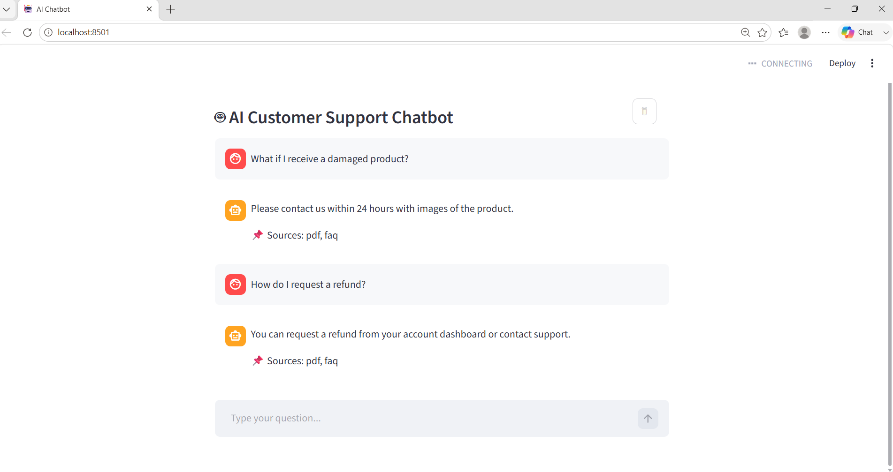
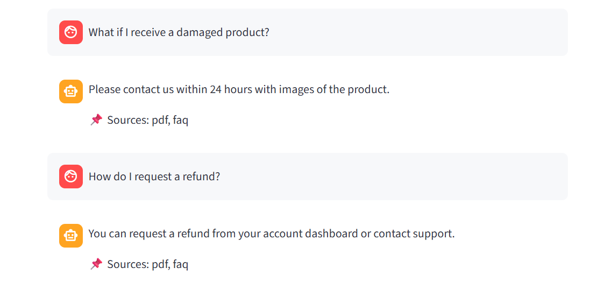

# AI Customer Support Automation

## Overview

This project is an AI-powered customer support automation system that answers user queries using PDF documents and FAQs. It uses a Retrieval-Augmented Generation (RAG) approach to provide accurate and context-aware responses.

---

## Features

* Automates customer query handling
* Answers questions from PDF documents
* Supports FAQ-based queries
* Provides context-aware responses
* Reduces hallucinations using strict filtering
* Displays answer sources (PDF / FAQ)
* Interactive user interface using Streamlit

---

## Screenshots

### User Interface



### Chat Response



---

## Tech Stack

* Backend: FastAPI
* Frontend: Streamlit
* LLM: Ollama (TinyLLaMA)
* Embeddings: Sentence Transformers
* Vector Database: FAISS
* Framework: LangChain

---

## Project Structure

```
ai-customer-support-automation/
│── screenshots/
│   ├── ui.png
│   ├── chat.png
│
│── data/
│   ├── sample.pdf
│   ├── faqs.txt
│
│── main.py
│── chatbot.py
│── vector_store.py
│── ui.py
│
│── requirements.txt
│── README.md
│── .gitignore
```

---

## How to Run

### Install Dependencies

```
pip install -r requirements.txt
```

### Create Vector Store

```
python vector_store.py
```

### Run Backend

```
uvicorn main:app --reload
```

### Run Frontend

```
streamlit run ui.py
```

---

## Ollama Setup

1. Install Ollama: https://ollama.com
2. Run:

```
ollama run tinyllama
```

---

## API Endpoints

* GET / → API status
* GET /health → Health check
* POST /chat → Get chatbot response

---

## How It Works

1. Loads data from PDF and FAQ files
2. Converts text into embeddings
3. Stores embeddings in FAISS
4. Retrieves relevant context
5. Sends context to the language model
6. Returns an accurate response

---

## Important Notes

* Do not upload `faiss_index/`
* Ensure Ollama is running
* Run `vector_store.py` before backend

---

## Future Improvements

* Add chat history memory
* Improve UI design
* Support multiple documents
* Deploy on cloud platforms

---

